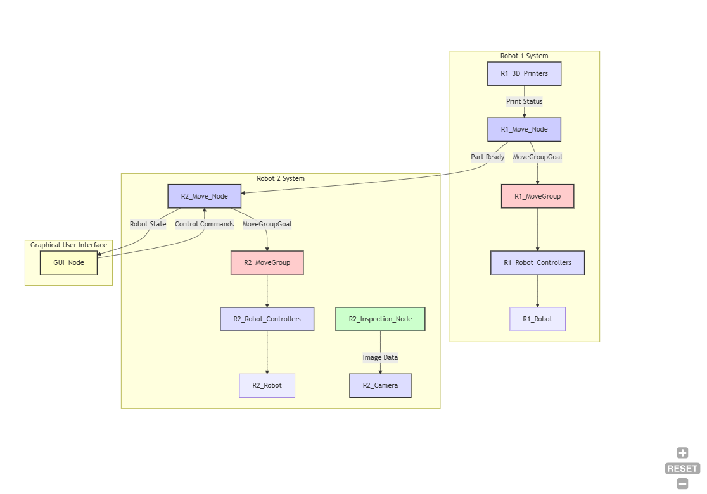

# Robot Station for 3D Printing with Vision Detection


## Overview

This project implements a robot station for automated 3D printing in a production environment, leveraging the Robot Operating System (ROS) for seamless integration and control. The station integrates a vision detection system to optimize the printing process and enhance efficiency.  The core components of the station, all managed within the ROS framework, are:

* **3D Printing:** 
* **Robot Manipulation:** A robotic arm, controlled through ROS, is used to unload the printed objects from the printers.
* **Vision System:**

## Functional Description
{ width=70% }


## Hardware Components

* **Robot Arm:** 
* **Vision System:** 

## Software Components
This Porject requires ROS Noetic to be install on your system. For a detailed guide on how to install ROS please use the ROS Wiki. [ROS-Wiki](https://wiki.ros.org/noetic/Installation)

### GUI
The GUI is written in Python, to include all neccesarry python packages please use the requirements.txt file. 

   ```bash
   pip install -r requirments.txt
   ```
## ROS Nodes

## Build Instructions (ROS-specific)

1. **ROS Environment:** Ensure you have a ROS environment set up with the required ROS distribution.
2. **Dependencies:** Install the necessary ROS packages using `rosdep`:

   ```bash
   sudo apt-get update  # Update package list
   rosdep install --from-paths src --ignore-src -r -y
   ```
## This is for a Course in the Master Robotics Engineering at UAS Technikum Wien
